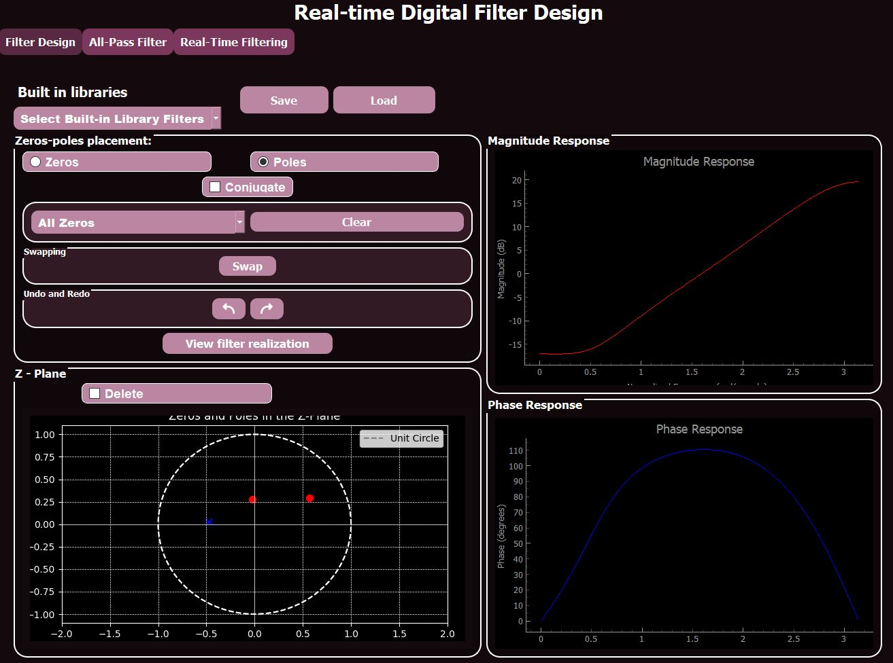

# Realtime Digital Filter Design

## Overview
This desktop application allows users to design custom digital filters through zero-pole placement on the z-plane. It provides interactive features for filter design, frequency response visualization, and real-time signal filtering.

## Features

### 1. **Z-Plane Plot & Zero-Pole Manipulation**
- Display of the z-plane with a unit circle.
- Interactive placement and modification of zeros and poles:
  - Drag to adjust positions.
  - Click to delete.
  - Clear all zeros, all poles, or both.
  - Option to add conjugates for complex elements.
  - Zero-pole swapping.
  - Undo/redo functionality.
  - Save and load filters (supports `.txt` and `.csv` formats).
- Filter realization options:
  - Direct Form II
  - Cascade Form
- Automatic C code generation for designed filters.

### 2. **Frequency Response Visualization**
- Graphs for:
  - Magnitude response
  - Phase response

### 3. **Built-in Filter Library**
- Includes at least 10 well-known digital filters:
  - Low-Pass (LPF), High-Pass (HPF), Band-Pass (BPF)
  - Butterworth, Chebyshev, Inverse Chebyshev, Bessel, Elliptic filters

### 4. **Real-Time Signal Filtering**
- Apply the designed filter to a signal in real time (minimum of 10,000 points).
- Two synchronized graphs:
  - Time-progress of the original signal.
  - Time-progress of the filtered signal (including phase-corrected output).
- Adjustable filtering speed via a slider (e.g., process 1 to 100 points per second).
- Real-time signal input via mouse movement:
  - Horizontal/vertical mouse motion generates a signal.
  - Fast movement results in high frequencies, slow movement in low frequencies.

### 5. **Phase Correction with All-Pass Filters**
- Built-in library of all-pass filters:
  - Visualization of zero-pole placement and phase response.
  - Selection of all-pass filters to refine phase response.
- Custom all-pass filter creation:
  - Users can input arbitrary coefficients, visualize the phase response, and integrate it into the library.
- Enable/disable added all-pass filters via dropdown or checkboxes.

## User Interface Structure

### **Window 1: Filter Design & Frequency Response**
- Z-plane plot for zero-pole placement.
- Frequency response graphs.
- Navigation bar for built-in filter library.
  

### **Window 2: Real-Time Signal Processing**
- Load an input signal from a file or generate using mouse movement.
- Graphs for raw and filtered signals.
- Speed control for real-time processing.
 

### **Window 3: Phase Correction with All-Pass Filters**
- Library of all-pass filters.
- Custom all-pass filter design.
- Visualization and management tools for phase correction.

   

